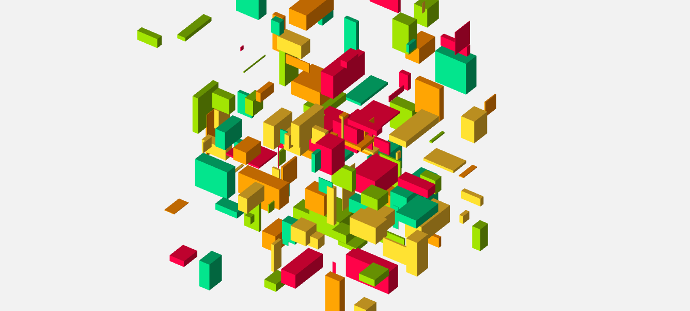

# CreativeCoding

🇪🇸
 
📜Proyecto / estudio de fundamentos de WebGL y Three.js

⚙️ Utilizando estas técnologias para la creacion artistica de imagenes con código

🇬🇧
 
📜 Study project of WebGL and Three.js fundamentals

⚙️ Using the technologies for artistic creations of images whit coding.

<h3>Contacto:</h3>

giannipasquinelli@gmail.com

<h3>Support Me!</h3>

Necesito mejorar mi notebook

 
 

I'm saving for an upgrade of my notebook

